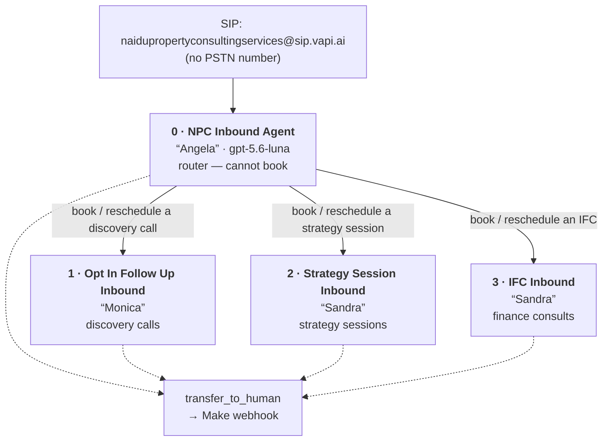

# NPC Sales Force — how the inbound squad actually works

`a9656ea1-3575-4ac6-b985-fd138be06cc5` · created 2025-12-09 · last changed 2026-05-12

The only NPC squad, and the only place in the Vapi org where a caller is routed between
assistants. Everything below is read from the committed snapshot; nothing is inferred from
the dashboard.

## Call flow

Member 0 answers. It carries an **inline `handoff_to_assistant` tool** — defined only in the
squad's `assistantOverrides['tools:append']`, not as a managed tool — which routes to the
other three by `assistantId`, saying *"Please hold on while I hand you over to the relevant
agent to book your call"* before it switches.

**The handoff wiring is sound.** All three destinations are squad members, all three
`assistantName` values match the live assistants, and each extracts `firstName`, which is
exactly the variable the receiving assistant's first message needs
(`"Hi {{firstName}}. I'm Monica…"`). Every specialist is set to `assistant-speaks-first`, so
the caller hears the new agent immediately. That part is correct and complete.

## The four members

| | Assistant | Persona | Voice ID | Prompt | Availability | Booking | Calls ever |
| ---: | --- | --- | --- | ---: | :---: | :---: | ---: |
| 0 | NPC Inbound Agent | Angela | `M7ya1YbaeFaPXljg9BpK` | 43,970 | — | — | 37 |
| 1 | NPC Opt In Follow Up Inbound | Monica | `cJi4iYb9fQ8QIRKkX8Fd` | 44,426 | yes | yes | **0** |
| 2 | NPC Strategy Session Inbound | Sandra | `02y4x5i9YrzYlFvGo1pp` | 40,648 | yes | yes | **0** |
| 3 | NPC IFC Inbound | Sandra | `02y4x5i9YrzYlFvGo1pp` | 41,511 | yes | **no** | **0** |

All four run `openai · gpt-5.6-luna` with no temperature set, all four post to the Supabase
`vapi-call-webhook`, and all four carry `transfer_to_human`.

## Seven things worth knowing

**1 · The IFC agent cannot complete a booking.** `NPC IFC Inbound` has
`ghl_check_availability` but **not** `ghl_create_booking` — while its prompt names
`ghl_create_booking` **15 times**, with rules like *"Immediately before calling
`ghl_create_booking`, Sandra must re-check availability…"* and *"Sandra may call
`ghl_create_booking` only after all are true…"*. The agent is instructed in detail to take a
booking it has no way to make. It can quote times and then fail at the last step. This is the
most consequential defect here.

**2 · Every specialist's prompt calls a tool only the router has.** All three reference
`get_call_context`, which is attached to `NPC Inbound Agent` alone. After a handoff the
receiving agent cannot fetch call context.

**3 · The router's prompt calls a tool it does not have.** `NPC Inbound Agent`'s prompt
references `ghl_check_availability`; it is not attached. By design the router hands off
rather than quoting times, so this is probably vestigial — but the prompt and the toolset
disagree.

**4 · Two agents are indistinguishable to a caller.** `NPC Strategy Session Inbound` and
`NPC IFC Inbound` both introduce themselves as **Sandra** and use the **same** ElevenLabs
voice `02y4x5i9YrzYlFvGo1pp`. After a handoff there is no audible or verbal cue as to which
one the caller reached.

**5 · The live human-transfer path depends on a Make scenario that cannot migrate — and a
working alternative already exists, unused.** There are two `transfer_to_human` tools:

| | Type | How it transfers | Used by |
| --- | --- | --- | ---: |
| `5c0c334c…` | `function` | POSTs to `hook.eu2.make.com/jb85m14j…` — the **blocked** *NPC Vapi - Transfer Caller to Human via Twilio Redirect* scenario | **13** |
| `3a6a892d…` | `transferCall` | **native Vapi transfer** to `+61433005110`, callerId `+61286093299`, warm-transfer TwiML | **0** |

The one in use needs Make. The one that needs nothing is attached to nothing. Switching to
the native tool would remove the Make data-store blocker from the escalation path entirely —
worth weighing before paying to unblock the scenario.

**6 · The squad is reachable only by SIP.** Its number is the Vapi-provider *NPC Services*
entry, `sip:naidupropertyconsultingservices@sip.vapi.ai`, with **no PSTN number and no
fallback destination**. The two Australian numbers in the org —
`+61286093299` (*Naidu Property Consulting Services*) and `+61281056305` (*NPC Services*) —
carry no `assistantId`, `squadId` or `workflowId` at all. Nothing in Vapi connects a real
phone line to this squad.

**7 · The routing has never run.** Member 0 has 37 calls, the most recent **2025-12-15**.
Members 1, 2 and 3 have **zero calls each, ever**. The squad was last edited 2026-05-12,
five months after its last call. No handoff has ever been executed in production, so none of
the above has been exercised — including the parts that are correct.

Two smaller things: the handoff description reads *"initital finance consult"*, and
`ghl_resolve_contact` is attached to all three specialists but named in none of their prompts.

## What migration has to get right

1. **Recreate the inline handoff tool with the squad** — it is not a managed tool and will not
   come across with `/tool`. Its three destination `assistantId`s must be **remapped** to the
   new org's ids; left as they are they point at the old org and the handoff fails silently.
2. **Create the four assistants before the squad**, so their new ids exist to be referenced.
3. **Decide the transfer path** — finding 5. This determines whether the Make plan upgrade is
   on the critical path.
4. **Re-point `transfer_to_human`** if you keep the Make route: it is the only squad tool
   still aimed at the old Make account.
5. **The SIP URI changes.** A Vapi-provider number is re-provisioned on clone and receives a
   new `sipUri`; anything dialling the old address breaks.

Full records: [`../npc-services/squads/`](../npc-services/squads),
[`squad-state/`](./squad-state), member configs in [`state/`](./state), prompts in
[`prompts/`](./prompts).
